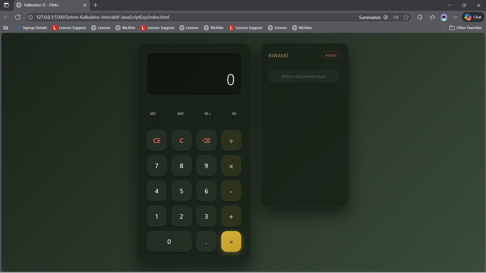
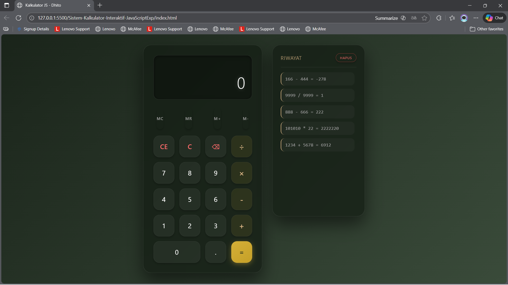
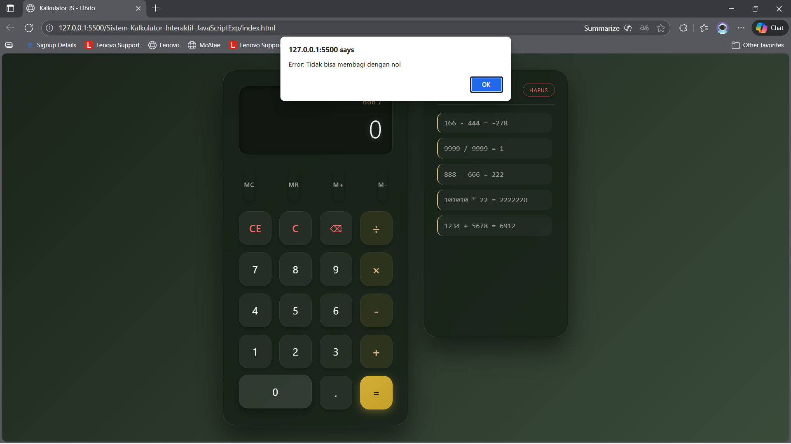
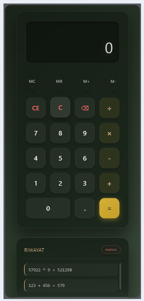

# Dhito Aryo Trengginas — Luxury Calculator

  

Selamat datang! Ini adalah repository untuk Tugas Akhir Praktikum Pemrograman Web (Percobaan 5: JavaScript Dasar). Proyek ini adalah **Aplikasi Kalkulator Interaktif** dengan desain "Luxury Army" yang elegan.

---

## 🚀 Tentang Proyek

Saya **Dhito Aryo Trengginas** — Mahasiswa Teknik Informatika (NPM **2315061015**).

Proyek ini bertujuan untuk mendemonstrasikan kemampuan manipulasi DOM, Event Handling, dan Logika Pemrograman menggunakan **JavaScript**.

-   **Konsep Desain:** *Dark Glassmorphism* dengan aksen Emas (Gold) & Hijau Army Gelap.
-   **Teknologi:** HTML5, CSS3 (Flexbox/Grid), JavaScript (ES6+).
-   **Fokus:** UI/UX Premium & Fungsionalitas Kompleks.

---

## 💎 Fitur Unggulan

### 1. Fungsionalitas (Logic)
* [cite_start]**Operasi Dasar:** Penambahan, Pengurangan, Perkalian, Pembagian[cite: 585].
* **Perhitungan Berantai:** Dapat menghitung `5 + 3 x 2` dengan urutan yang benar.
* [cite_start]**Error Handling:** Mencegah pembagian dengan nol (Alert Warning)[cite: 587].
* [cite_start]**Keyboard Support:** Bisa menggunakan Numpad keyboard untuk mengetik angka dan operator[cite: 588].
* [cite_start]**Advanced Memory:** Fitur `M+`, `M-`, `MR`, dan `MC` berfungsi penuh[cite: 591].

### 2. Tampilan (UI/UX)
* **Luxury Theme:** Latar belakang gradasi Army Green gelap dengan efek kaca (*frosted glass*).
* **Gold Accents:** Tombol penting diberi warna emas untuk kesan mewah.
* [cite_start]**Responsive Design:** Layout otomatis menyesuaikan tampilan Desktop (Side-by-side) dan Mobile (Stacked)[cite: 592].
* [cite_start]**Interactive History:** Riwayat perhitungan yang dapat diklik untuk menggunakan kembali angkanya[cite: 590].

---

## 🔧 Cara Menjalankan

Karena proyek ini berbasis **Client-Side**, Anda tidak memerlukan server (XAMPP/Apache).

1.  Clone atau download repository ini.
2.  Buka file `index.html` (atau `index.php`) langsung menggunakan browser modern (Chrome, Edge, Firefox).
3.  Kalkulator siap digunakan!

---

## 📸 Tampilan (Screenshots)

Berikut adalah dokumentasi tampilan aplikasi:

### 1. Tampilan Desktop (Full UI)
Desain *Dark Glass* dengan layout berdampingan antara kalkulator dan history.

### 2. Demo Perhitungan
Menampilkan hasil perhitungan dengan tipografi yang jelas dan efek *glow*.

### 3. Fitur History & Error Mode
Panel riwayat menyimpan 5 perhitungan terakhir. Pembagian 0 tidak bisa dilakukan.

### 4. Tampilan Mobile (Responsif)
Layout otomatis berubah menjadi vertikal saat diakses melalui perangkat seluler.

---

## 📬 Kontak

-   **Email:** aryodhito20@gmail.com
-   **GitHub:** https://github.com/dhitoary
-   **LinkedIn:** https://www.linkedin.com/in/dhito-aryo-trengginas-1b886629

---

Terima kasih.
